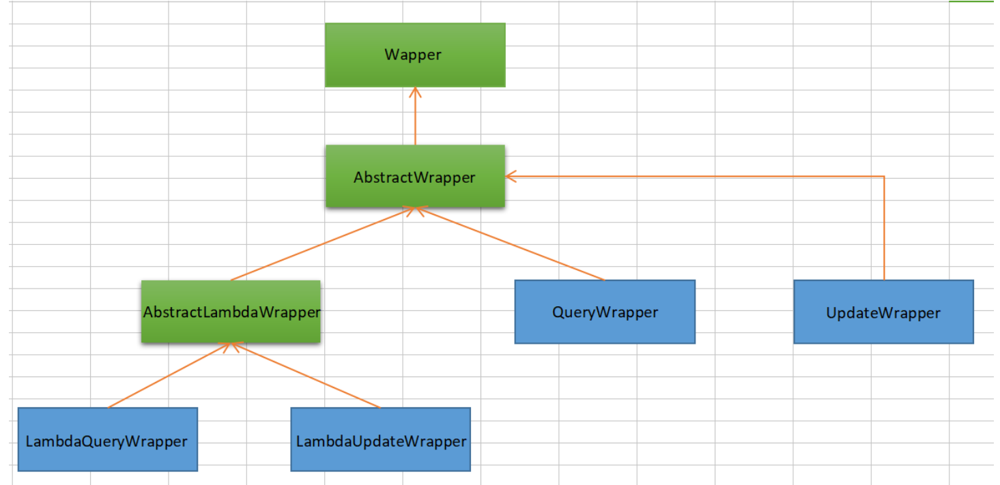
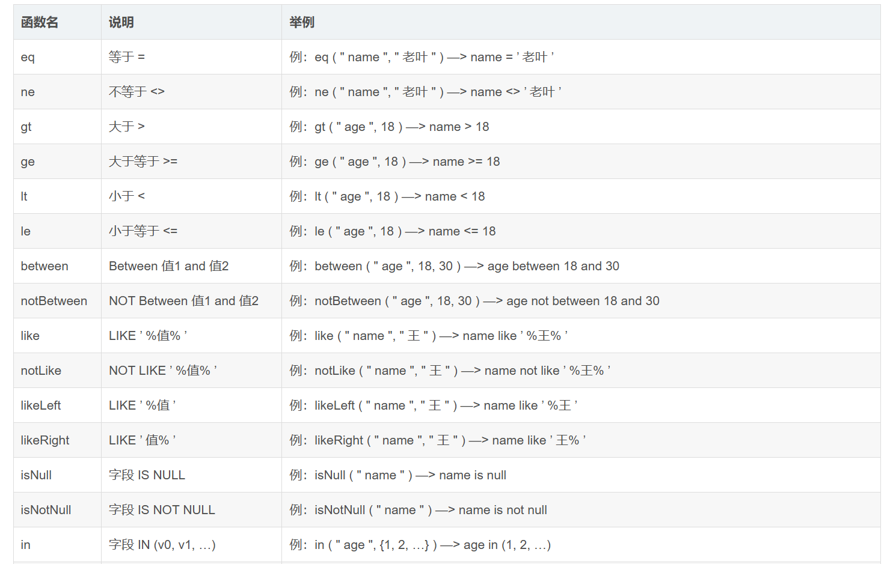
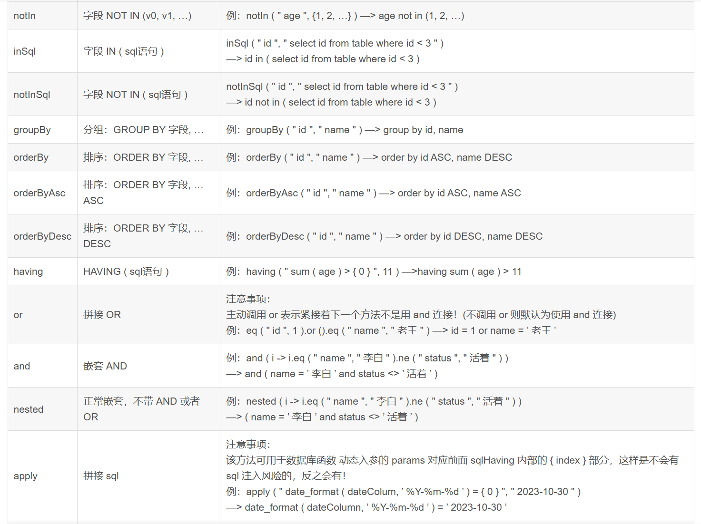
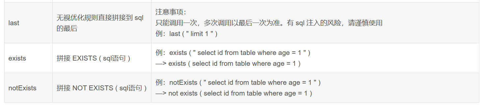

## Mybatis-Plus测试
本项目提供了对Mybatis-Plus工具提供的部分持久层和服务层接口的使用方法

所用接口的使用请参考Mybatis-plus官方文档
<https://baomidou.com/guides/data-interface>

### wrapper介绍：
Wrapper是MyBatis-Plus框架提供的一个查询条件构建器，用于构建复杂的查询条件。它可以帮助开发者更方便地构建 SQL 查询语句，而不需要手动编写 SQL。

其相关类关系图如下：

Wrapper ：条件构造抽象类，最顶端父类  
AbstractWrapper ： 用于查询条件封装，生成 sql 的 where 条件  
*QueryWrapper ：Entity 对象封装操作类，不是用lambda语法  
*UpdateWrapper ： Update 条件封装，用于Entity对象更新操作  
AbstractLambdaWrapper ： Lambda 语法使用 Wrapper统一处理解析 lambda 获取 column。  
LambdaQueryWrapper ：看名称也能明白就是用于Lambda语法使用的查询Wrapper  
LambdaUpdateWrapper ： Lambda 更新封装Wrapper  

### wrapper函数用法

